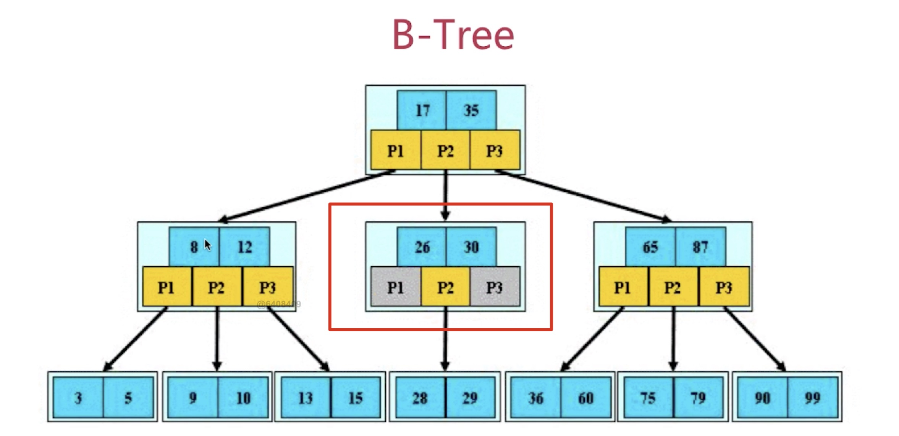
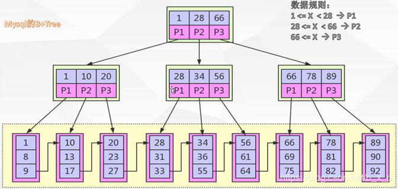

## B树和B+树
 **BTree**
 
* 根结点至少有两个子女
* 每个非根节点所包含的关键字个数 j 满足(m除以2-1<=j<=m-1)
* 除根结点以外的所有结点(不包括叶子结点)的度数正好是关键字总数加1，故内部子树个数k满足：m除以2<=k<=m
* 所有的叶子结点都位于同一层

**B+TRee**
  

  **B树和B+树区别**
  
 * B+TREE 关键字的搜索采用的是左闭合区间，之所以采用左闭合区间是因为他 要最好的去支持自增 id，这也是 mysql 的设计初衷。即，如果id =1命中，会 继续往下查找，直到找到叶子节点中的 1
 * B+TREE 根节点和支节点没有数据区，关键字对应的数据只保存在叶子节点中。 即只有叶子节点中的关键字数据区才会保存真正的数据内容或者是内容的地址  
   而在 B 树种，如果根节点命中，则会直接返回数据。并且在 B+TREE 中，叶子节 点不会去保存子节点的引用。
 * B+TREE 叶子节点是顺序排列的，并且相邻的节点具有顺序引用的关系，如上图中叶子节点之间有指针相连接。
   
 