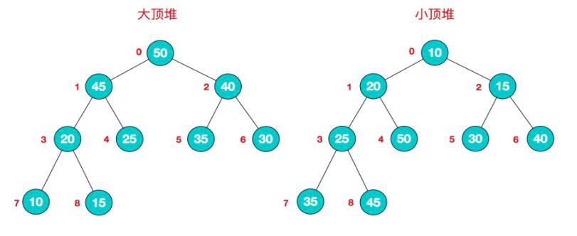

## 堆
* 什么是堆？ 
堆是一种非线性结构，（本篇随笔主要分析堆的数组实现）可以把堆看作一个数组. 
也可以被看作一个完全二叉树，通俗来讲堆其实就是利用完全二叉树的结构来维护的一维数组 
按照堆的特点可以把堆分为大顶堆和小顶堆  
大顶堆：每个结点的值都大于或等于其左右孩子结点的值  
小顶堆：每个结点的值都小于或等于其左右孩子结点的值 

* 我们用简单的公式来描述一下堆的定义就是：（读者可以对照上图的数组来理解 下面两个公式） 
  大顶堆：arr[i] >= arr[2i+1] && arr[i] >= arr[2i+2] 
  小顶堆：arr[i] <= arr[2i+1] && arr[i] <= arr[2i+2] 
