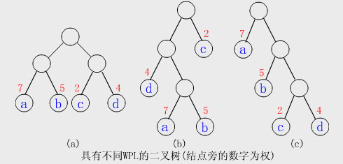

## 哈夫曼树
* 给定n个权值作为n个叶子结点，构造一棵二叉树，若该树的带权路径长度达到最小，称这样的二叉树为最优二叉树.
也称为哈夫曼树(Huffman Tree)。哈夫曼 树是带权路径长度最短的树，权值较大的结点离根较近。 
 **特点**
* 没有度为 1 的结点
* n 个叶子节点的哈夫曼树共有 2n-1 个结点 树的特点：度为 2 结点和叶结点的关系
 n2=n0-1 所以：当叶结点为 n 时，度为二的结点数为 n-1 因为哈夫曼没有度为一的结点，
 所以一共在树中有 2n-1 个结点
* 哈夫曼树任意非叶结点的左右子树交换后还是哈夫曼树 
  **哈夫曼编码**
* 固定一段字符串，如何对字符串进行编码，可以使得该字符串的编码存储空间最少

 
