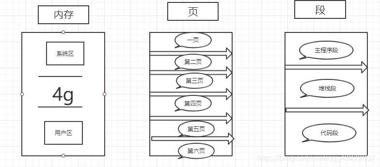

## 内存管理
**windows下内存管理**

* 虚拟内存：最适合用来管理大型对象或者结构数组
* 内存映射文件：最适合用来管理大型数据流（通常来自文件）以及在单个计算机上运行多个进程之间共享数 据
* 内存堆栈：最适合用来管理大量的小对象

**中断和轮询的特点**
 * 对 I/O 设备的程序轮询的方式，是早期的计算机系统对 I/O 设备的一种管理方式。它定 时对各种设备轮流询问一遍有无处理要求。轮流询问之后，有要求的就加以处理。在处理 I/O 设备的要求之后，处理机返回继续工作。尽管轮询需要时间，但轮询要比 I/O 设备的速度要 快得多，所以一般不会发生不能及时处理的问题。
 当然，再快的处理机，能处理的输入输出 设备的数量也是有一定限度的。而且，程序轮询毕竟占据了 CPU 相当一部分处理时间，因 此程序轮询是一种效率较低的方式，现代计算机系统中已很少应用。 轮询效率低，等待时间很长，CPU 利用率不高；中断容易遗漏一些问题，CPU 利用率高。

**什么是临界区，如何解决冲突**
  * 每个进程中访问临界资源的那段程序称为临界区，每次只准许一个进程进入临界区，进 入后不允许其他进程进入。如果有若干个进程要求进入空闲的临界区，一次仅允许一个进程 进入。任何时候，处于临界区的进程不可多于一个。如已有进程进入自己的临界区，则其他 试图进入临界区的进程必须等待。进入临界区的进程要在有限时间内退出，以便其他进程能 及时进入自己的临界区。如果不能进入自己的临界区，就应该让出 CPU，避免进程出现忙等 等现象。
 
**分页和分段的区别** 
 * 页是信息的物理单位，分页是为了实现离散分配方式，以减少内存的外零头，提高内存 的利用率。分页仅仅是由于系统管理的需要，而不是用户的需要。
  段是信息的逻辑单位，它含有一组其意义相对完整的信息。分段的目的是为了能更好的
  满足用户的需要。
 *  页的大小固定且由系统确定，把逻辑地址分为页号和页内地址两部分，由机器硬件实现 的。因此一个系统只能有一种大小的页面。段的长度却不固定，决定于用户所编写的程序， 通常由编写程序在对源代码进行编辑时，根据信息的性质来划分。
 * 分页的作业地址空间是一维的，即单一的线性空间。 
 * 分段的作业地址空间是二维的，程序员在标识一个地址时，既需要给出段名，又需要给 出段内地址。
 
 * 首先操作系统把内存分区。每个区里又分页，每个页里又分表。
 
 
 
 * 整个操作系统把内存切分区，我们平常运行的软件都在用户区里分配空间。
 
 * 程序在加载的时候会给用户分配空间，分配空间的大小取决于进程的大小。进程 小的话可以一两个页就够，大的话就需要分配多 的页。分配的页也不是连续的，可能给某个进程分配的页是不连续性的。例如分 配到了 1，3，5，6 页。
 * 那么怎么根据页的逻辑地 址去找到对应的实际物理存储位置呢？
 * 比如有 16 位的页地址对用 16 位的物理地址。 页的地址的高四位是对应的物理地址的块，低十二位是对应物理地址的偏移量。 所以当有一个逻辑地址送过来的时候。可以把这个串分割，前四位查出来的数去 页表寄存器查找对一个物理块的哪个地址， 再与后八位拼接形成实际的物理地址。
 
**简单分页的特点**
 
 * 分页的内容少，产生的碎片少。
 * 一个进程可以占有多个分页
 * 占用多个分页不需要连续。充分利用空闲分页。
 * 分段也是类似的实现， 段和段之间不需要连续。每个段和物理地址之间有一个映射关系，叫做段表。类 似于页表。段表中记录了段的基址和段长。 访问段表的时候先查看是否大于该段的长度，如果大于则越界。访问失败。如果小于，则用该段的始址加上段内地址得到对应的物理地址。
 