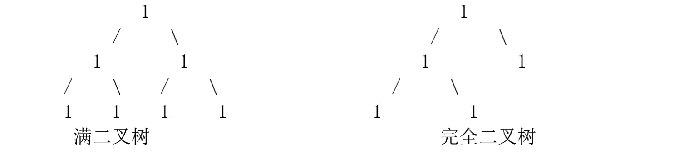

## 二叉树
- 二叉树： 是 n(n>=0)个结点的有限集合，它或者是空树（n=0），或者是由一个根结 点及两颗互不相交的、分别称为左子树和右子树的二叉树所组成。 
- 满二叉树： 一颗深度为 k 且有 2^k-1 个结点的二叉树称为满二叉树。 除叶子结点外的所有结点均有两个子结点。节点数达到最大值。所有叶子结 点必须在同一层上。
- 完全二叉树： 若设二叉树的深度为 h，除第 h 层外，其它各层 (1～h-1) 的结点数 都达到最大个数，第 h 层所有的结点都连续集中在最左边，这就是完全二叉树。
- 判断完全二叉树 完全二叉树：除最后一层外，每一层上的节点数均达到最大值；在最后一层 上只缺少右边的若干结点。
- 完全二叉树和满二叉树区别 二叉树分类很多，其中满二叉树和完全二叉树比较特殊，因为这两种二叉说 效率很高，这里记录几条相关性质。 
   **首先是满二叉树**：从形象上来说满二叉树是一个绝对的三角形，也就是说它的最后一层全部是叶子节点，其余各层全部是非叶子节点. 
   如果用数学公式表示那么其节点数 n=2^k-1 其中 k 表示深度，也就是层数。 
   也就是说满二叉树的节点 数是一系列固定的数，比如说，1,3,7,15...如果节点数不是这个序列中的数，那么他肯定不是满二叉树. 
   当然了，反之，是不成立的。 由于它的节点数和形状固定，我们可以发现很多其数学公式性质。  
   首先是节点数和深度的关系 n=2^k-1  
   第二是第 i 层上的节点数为 2^(i-1)  
   第三是给所有的节点编号（从 1 号开始而不是从零号开始）那没对于一个编 号为 i 的节点我们可以根据 i 的大小，判断出他是左节点还是右节点，父节点是谁，子节点是谁。 
   比如我们给一个编号 13 的节点，那么他是基数所以他是右节 点，因为节点的左右变化和数据的基偶性是同步变化的。 
   他的父节点是 13除以2=6(是从 1 好开始的)他的左子节点是 13乘以2=26 右子节点是 13乘以2+1=27  
   同理还可以求他的兄弟节点，父节点的父节点,总而言这在满二叉树中只要有了一个节点的编号那么他在整个二叉树中的位置就确定了，正是由于这个原因，我们更倾向于使用顺序结构而不是链式结构 来存储满二叉树。 
   然而由于满二叉树的节点数必须是一个确定的数，而非任意数，他的使用受 到了某些限制，为了打破另一个限制，我们定义一种特殊的满二叉树——完全二叉树。 
   完全二叉树的节点个数是任意的，从形式上来说他是一个可能有缺失的三角 形，但所缺部分肯定是右下角的某个连续部分。 
   这样说不玩整，更准确来说，我们可以说他和满二叉树的区别是，他的最后一行可能不是完整的，但绝对是右方 的连续部分缺失。 
   可能听起来有点乱，用数学公式讲，对于 K 层的完全二叉树， 其节点数的范围是 2^(k-1)-1<N<2^k-1; 一棵深度为 k 且有 2 的 k 次方减 1 个结点的二叉树是满二叉树。 
   深度为 k 的，有 n 个结点的二叉树，当且仅当其每一个结点都与深度为 k 的满二叉树中编号从 1 至 n 的结点一一对应时，称为完全二叉树 

