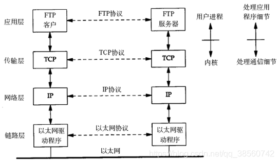
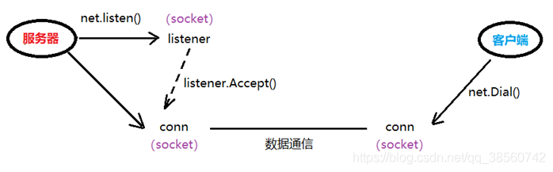

## 网络通信

* 网络通信过程
 * 数据通信：
 * 封装： 应用层 —— 传输层 —— 网络层 —— 链路层	。 没有经过封装的数据，不能在网络环境中传递。
 * 解封装 ： 链路层 —— 网络层 —— 传输层 —— 应用层
    
    
* **socket套接字**
  **Socket原理**
  * Socket 连接,至少需要一对套接字，分为 clientSocket，serverSocket 连接分为3个步骤: 
  * 服务器监听:服务器并不定位具体客户端的套接字，而是时刻处于监听状态； 
  * 客户端请求:客户端的套接字要描述它要连接的服务器的套接字，提供地址和端口号，然后向服务器套接字提出连接请求； 
  * 连接确认:当服务器套接字收到客户端套接字发来的请求后，就响应客户端套接字的请求,并建立一个新的线程,把服务器端的套接字的描述发给客户端。一旦客户端确认了此描述，就正式建立连接。而服务器套接字继续处于监听状态，继续接收其他客户端套接字的连接请求.
  * Socket为长连接：通常情况下Socket 连接就是 TCP 连接，因此 Socket 连接一旦建立,通讯双方开始互发数据内容，直到双方断开连接。在实际应用中，由于网络节点过多，在传输过程中，会被节点断开连接，因此要通过轮询高速网络，该节点处于活跃状态。
 
  * 网络通信过程中，socket 一定是成对出现的。
  * 在TCP/IP协议中，“IP地址+TCP或UDP端口号”唯一标识网络通讯中的一个进程。
  * IP地址+端口号:就对应一个socket。
  * 欲建立连接的两个进程各自有一个socket来标识，那么这两个socket组成的socket pair就唯一标识
    一个连接。
  * Socket来描述网络连接的一对一关系。
  * 常用的Socket类型有两种：流式Socket（SOCK_STREAM）和数据报式Socket（SOCK_DGRAM）。
  * 流式是一种面向连接的Socket，针对于面向连接的TCP服务应用；
  * 据报式Socket是一种无连接的Socket，对应于无连接的UDP服务应用。    
  * Socket是对TCP/IP协议的封装，Socket本身并不是协议，而是一个调用接口（API），通过Socket，我们才能使用TCP/IP协议。
  * TCP/IP是传输层协议，主要解决数据如何在网络中传输；而Http是应用层协议，主要解决如何包装数据。  
  * Socket是对TCP/IP协议的封装，Socket本身并不是协议，而是一个调用接口（API），通过Socket，我们才能使用TCP/IP协议。   
  * Http连接：http连接就是所谓的短连接，及客户端向服务器发送一次请求，服务器端相应后连接即会断掉。 
  * socket连接：socket连接及时所谓的长连接，理论上客户端和服务端一旦建立连接，则不会主动断掉；但是由于各种环境因素可能会是连接断开，比如说：服务器端或客户端主机down了，网络故障，或者两者之间长时间没有数据传输，网络防火墙可能会断开该链接已释放网络资源。所以当一个socket连接中没有数据的传输，那么为了位置连续的连接需要发送心跳消息，具体心跳消息格式是开发者自己定义的。   
  * HTTP的长连接一般就只能坚持一分钟而已，而且是浏览器决定的，你的页面很难控制这个行为。
  * Socket连接就可以维持很久，几天、数月都有可能，只要网络不断、程序不结束，而且是可以编程灵活控制的。
  * HTTP连接是建立在Socket连接之上。在实际的网络栈中，Socket连接的确是HTTP连接的一部分。但是从HTTP协议看，它的连接一般是指它本身的那部分。
  * Websocket
  * Websocket协议解决了服务器与客户端全双工通信的问题。
  * 注:什么是单工、半双工、全工通信？
  * 信息只能单向传送为单工；
  * 信息能双向传送但不能同时双向传送称为半双工；
  * 信息能够同时双向传送则称为全双工。
  * websocket协议解析
  * wensocket协议包含两部分:一部分是“握手”，一部分是“数据传输”。
  

