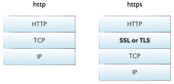
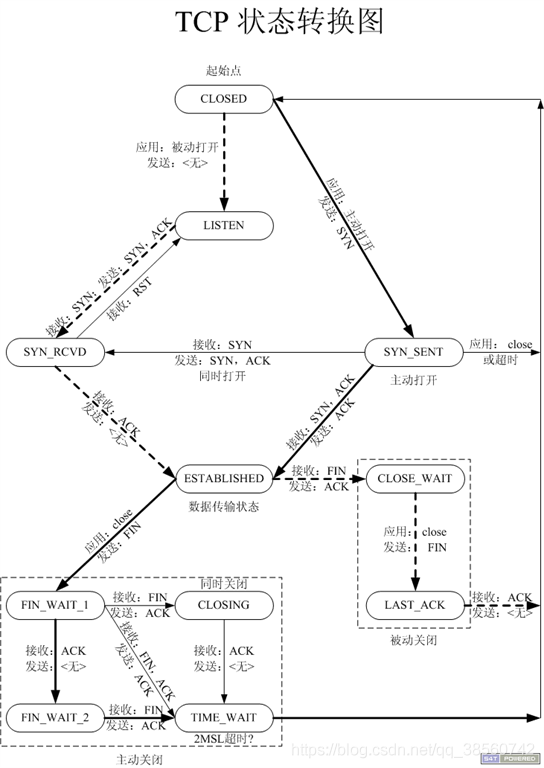

## HTTP通信原理和HTTPS通信原理

**概念**
 * HTTP 协议（HyperText Transfer Protocol，超文本传输协议）：是客户端浏览器或其他程序与Web服务器之间的应用层通信协议 。HTTPS（全称：HyperText Transfer Protocol over Secure Socket Layer），可以理解为HTTP+SSL/TLS， 即 HTTP 下加入 SSL 层，HTTPS 的安全基础是 SSL，因此加密的详细内容就需要 SSL，用于安全的 HTTP 数据传输。
 * 支持客户/服务器模式 ； 简单快速：客户向服务器请求服务时，只需要传 送请求方法和路径。请求方法常用的有 GET、HEAD、POST。 
 * 灵活 ： HTTP 允许 传输任意类型的数据对象 无连接：无连接的含义是限制每次连接只处理一个 请求。
 * 服务器处理完客户的请求，收到客户的应答后，即断开连接。
 * 无状态：http 是无协议状态，无状态意思是协议对于事务处理没有记忆能力。
 * 缺少状态意味着 如果后序处理需要前面的信息，则它必须重传，这样可能导致每次连接传送的数 据量增大。HTTP1.1 支持持续连接
* **Http版本1.1,2.0**
   * HTTP1.1 默认支持长连接， HTTP1.1 节省带宽，默认只发送 header，如果 服务器认为客户端有权限进行连接请求服务器，则返回 100， 否则返回 401.如 果客户端接收到 100， 就把 body 传递给服务器。
   * HTTP1.1 有 host 域 HTTP 2. 0 多路复用（一个连接可以处理多个请求）
   * HTTP2.0 支持 header 压缩，在网络上传输会更快 我们对 HTTP2.0 的服务器进行请求数据的时候， 服务器会顺便把一些客户 端需要的资源一起推送到客户端，避免客户端再次创建连接发送请求到服务器获 取
* **HTTPS和HTTP的区别**：
   * https协议需要到ca申请证书，一般免费证书很少，需要交费。
   * http是超文本传输协议，信息是明文传输；https 则是具有安全性的ssl加密传输协议。
   * http和https使用的是完全不同的连接方式，用的端口也不一样，前者是80，后者是443。
   * http的连接很简单，是无状态的；HTTPS协议是由SSL+HTTP协议构建的可进行加密传输、身份认证的网络协议，比http协议安全。
 
* **HTTP通信机制**

* HTTP通信机制是在一次完整的HTTP通信过程中，Web浏览器与Web服务器之间将完成下列7个步骤：
* 建立TCP连接（TCP的三次握手原理）
* 在HTTP工作开始之前，Web浏览器首先要通过网络与Web服务器建立连接，该连接是通过TCP来完成的，该协议与IP协议共同构建Internet，即著名的TCP/IP协议族，因此Internet又被称作是TCP/IP网络。HTTP是比TCP更高层次的应用层协议，根据规则，只有低层协议建立之后才能进行更深层协议的连接，因此，首先要建立TCP连接，一般TCP连接的端口号是80。
* Web浏览器向Web服务器发送请求命令
* 一旦建立了TCP连接，Web浏览器就会向Web服务器发送请求命令
* 例如：GET/sample/hello.jsp HTTP/1.1。
* Web浏览器发送请求头信息浏览器发送其请求命令之后，还要以头信息的形式向Web服务器发送一些别的信息，之后浏览器发送了一空白行来通知服务器，它已经结束了该头信息的发送。
* Web服务器应答。客户机向服务器发出请求后，服务器会客户机回送应答，
* HTTP/1.1 200 OK
* 应答的第一部分是协议的版本号和应答状态码。
* Web服务器发送应答头信息
* 正如客户端会随同请求发送关于自身的信息一样，服务器也会随同应答向用户发送关于它自己的数据及被请求的文档。
* Web服务器向浏览器发送数据
* Web服务器向浏览器发送头信息后，它会发送一个空白行来表示头信息的发送到此为结束，接着，它就以Content-Type应答头信息所描述的格式发送用户所请求的实际数据。
* Web服务器关闭TCP连接
* 一般情况下，一旦Web服务器向浏览器发送了请求数据，它就要关闭TCP连接，然后如果浏览器或者服务器在其头信息加入了这行代码
* Connection:keep-alive

**HTTPS产生背景**
* HTTP协议是没有加密的明文传输协议，如果Client(APP、浏览器)采用HTTP传输数据，则会泄露传输内容，可能被中间人劫持，修改传输的内容。

**HTTPS通信原理**
* HTTPS是HTTP over SSL/TLS，HTTP是应用层协议，TCP是传输层协议，在应用层和传输层之间，增加了一个安全套接层SSL/TLS：
  

* 如上图所示 HTTPS 相比 HTTP 多了一层 SSL/TLS，SSL/TLS层负责客户端和服务器之间的加解密算法协商、密钥交换、通信连接的建立。   
* TCP连接在发送后将仍然保持打开状态，于是，浏览器可以继续通过相同的连接发送请求。保持连接节省了为每个请求建立新连接所需的时间，还节约了网络带宽。
* 三次握手：
	* 主动发起请求端， 发送 SYN 
	* 被动建立连接请求端 ， 应答ACK 同时 发送 SYN
	* 主动发起请求端，发送应答 ACK
	* 标志 TCP 三次握手建立完成。 —— server：Accept() 返回 。— client：Dial() 返回。
* 四次挥手：
	* 主动关闭连接请求端， 发送 FIN
	* 被动关闭连接请求端 ，应答 ACK标志。半关闭完成。 —— close()
	* 被动关闭连接请求端 ，发送 FIN
	* 主动关闭连接请求端，应答 ACK标志。四次挥手建立完成。 —— close().
	
  
  
  