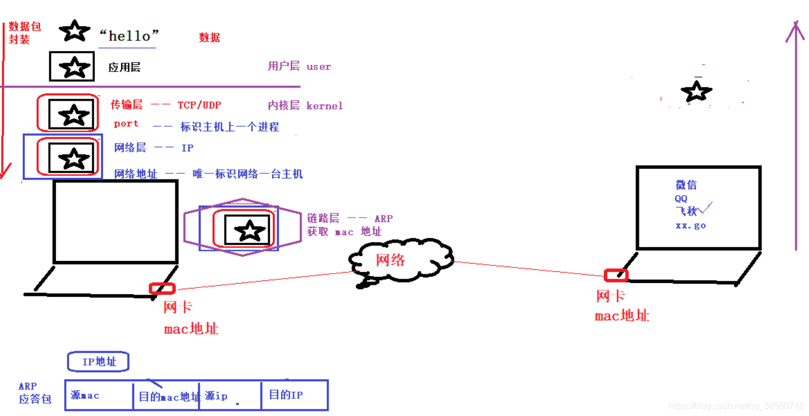

##  网络协议以及所属的分层
 **IPv4和IPv6网络**
  
* IPV4和baiIPV6的区别参考如下：
  * IPv4可提供4,294,967,296个地址du，IPv6将原来的32位地址空间增大zhi到128位，数目是dao2的128次方。能够对地球上每平方米提供6×1023个网络地址，在可预见的将来是不会耗尽的。 　　
  * IPv4 使用地址解析通讯协议 (ARP) ，IPv6使用用多点传播 Neighbor Solicitation 消息取代地址解析通讯协议 (ARP) 。 　　
  * IPv4 中路由器不能识别用于服务质量的QoS 处理的 payload。IPv6中路由器使用 Flow Label 字段可以识别用于服务质量的 QoS 处理的 payload。 　　 　　
  * IPv4的回路地址为: 127.0.0.1，IPv6的回路地址为 : 000:0000:0000:0000:0000:0000:0000:0001 可以简写为 ::1。 　　
  * 在IPv4中，动态主机配置协议（ Dynamic Host ConfigurationProtocol，DHCP）实现了主机IP地址及其相关配置的自动设置。一个DHCP服务器拥有一个IP地址池，主机从DHCP服务器租借IP地址并获得有关的配置信息（如缺省网关、DNS服务器等），由此达到自动设置主机IP地址的目的。IP v6继承了IPv4的这种自动配置服务，并将其称为全状态自动配置（stateful autoconfiguration）。 m.pcwenku.com 供稿 　　
  * IPv4使用 Internet 群组管理通讯协议 (IGMP) 管理本机子网络群组成员身份，IPv6使用 Multicast Listener Discovery (MLD) 消息取代 IGMP。 　　
  * 内置的安全性。IPSec由IETF开发是确保秘密、完整、真实的信息穿越公共IP网的一种工业标准。IPsec不再是IP协议的补充部分，在IPv6中IPsec是IPv6自身所具有的功能。IPv4选择性支持IPSec，IPv6自动支持IPSec。 　　
  * 更好的QoS支持。QoS是网络的一种安全机制，通常情况下不需要QoS，但是对关键应用和多媒体应用就十分必要。当网络过载或拥塞时，QoS 能确保重要业务量不受延迟或丢弃，同时保证网络的高效运行。在IPv6 的包头中定义了如何处理与识别传输， IPv6 包头中使用 Flow Label 来识别传输，可使路由器标识和特殊处理属于一个流量的封包。流量是指来源和目的之间的一系列封包，因为是在 IPv6 包头中识别传输，所以即使透过 IPSec 加密的封包 payload，仍可实现对 QoS 的支持。
  
  **OSI（Open System Interconnection Reference Model)**
  
* 链路层：以太网规定，连入网络的所有设备，都必须具有“网卡”接口。
   * 数据包必须是从一块网卡，传送到另一块网卡。通过网卡能够使不同的计算机之间连接，从而完成数据通信等功能。
   * 网卡的地址——MAC 地址（全球唯一），就是数据包的物理发送地址和物理接收地址。      
   * 链路层速记：ARP（核心协议）
   * 源mac —— 目标mac
   * ARP 协议作用： 借助 IP 获取 mac 地址。
   * MAC 地址是绑定在网卡上的
   * IP 地址则是管理员分配的 
* 网络层：
  网络层的作用是引进一套新的地址，使得我们能够区分不同的计算机是否属于同一个子网络。这套地址就叫做“网络地址”，这是我们平时所说的IP地址。网络层协议包含的主要信息是源IP和目的IP。
  
  * 网络层速记：IP（核心协议）
  * 源IP —— 目标IP
  * IP协议的作用： 在 网络环境中唯一标识一台主机。
  * IP地址本质：2进制数。—— 点分十进制 IP地址 （string）
  * IP和MAC的作用：
  * 网络地址（IP）:帮助我们确定计算机所在的子网络
  * MAC 地址:则将数据包送到该子网络中的目标网卡。
  * 处理顺序：从逻辑上可以推断，必定是先处理网络地址，然后再处理 MAC 地址
* 传输层：
  * **端口**:确定进程
  * 对于同一个端口，在不同系统中对应着不同的进程
  * 对于同一个系统，一个端口只能被一个进程拥有
  * 传输层速记：TCP / UDP（核心协议）
  *port —— 在 一台主机上唯一标识一个进程。
* 应用关系：
  * 通过网络层IP确认交互端，通过MAC确认信息发送目标，最终通过端口指定要发生信息交互的程序
  
  
* 应用层
  * 接到传输层传递过来的数据就要对数据进行解析，应用层就是规定程序的数据格式
  * 应用层速记：ftp、http、自定义
  * 对数据进行封装。 解封装
  * TCP/IP:TCP/IP协议是一个大家族，不仅仅只有TCP和IP协议，它还包括其它的协议

    
  
   